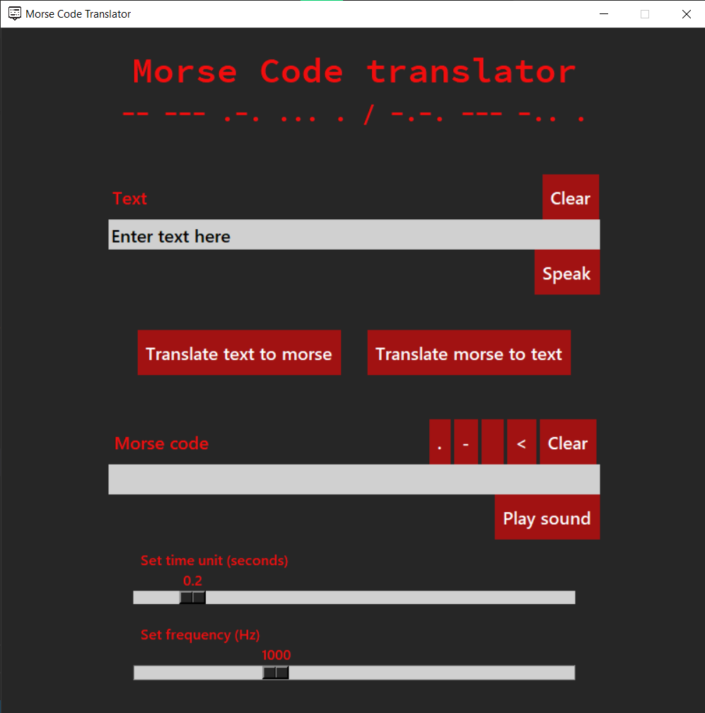

# Morse Translator

## About
A simple morse code translator built in Python using tkinter.

    

**Note:** This project uses winsound which is Windows exclusive.

### Features
1. Translate text to morse code and vice-versa.
2. Play morse sound.
3. Alter speed and frequency of morse sound.
4. Text to speech.

## Run locally
### Install relevant modules
    > pip install gtts playsound
### Clone repo
    > git clone git@github.com:arish00100/morse-translator.git
    > cd morse-translator
### Run
    > py morse.py

